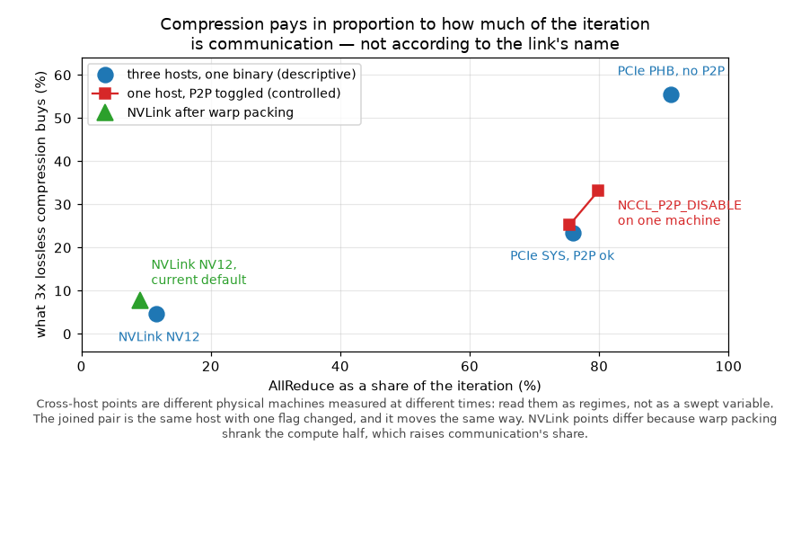
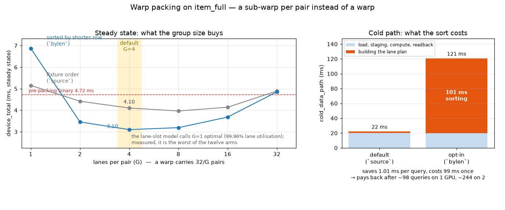

# Multi-Backend Pearson Similarity Engine

One recommender kernel — the Pearson correlation between two items' co-raters —
extracted from an archived USC INF553 PySpark project, frozen behind a
numerical contract, and re-implemented across **serial C++, OpenMP, MPI,
single-GPU CUDA and two-GPU NCCL**, every backend validated bit-exact against
the same golden similarities.

The question it studies: **when is it worth compressing what a collective
sends?** The shape is familiar from data-parallel training — each GPU computes
a partial result over its shard, an AllReduce sums the partials. In DDP those
partials are gradients; here they are six statistics per item pair.

```
   item_full:  10,253 items · 488,560 ratings · 1,171,857 candidate pairs
                                  │
                 rating dimensions split across GPUs
                    ┌─────────────┴─────────────┐
                  GPU 0                       GPU 1
        partial (n,Σx,Σy,Σxx,Σyy,Σxy)   partial (n,Σx,Σy,Σxx,Σyy,Σxy)
        per pair · 4 lanes per pair     per pair · 4 lanes per pair
                    └─────────────┬─────────────┘
              packed to 2×uint64 (21 bits per field, lossless)
              ncclAllReduce(ncclSum) — summed WHILE STILL PACKED
                                  │
                unpack → Pearson finalize → 1,171,857 similarities
```

The six statistics are secretly small integers, because the ratings behind them
are 1–5 stars: 85 bits of content in 384 bits of wire format. So 56 MB of
`float64` packs into **18.7 MB with no loss at all**, and because the partition
is over the rating dimension, `pack(a) + pack(b) == pack(a + b)` — NCCL never
sees the uncompressed form.

What that 3x is worth **tracks how much of the iteration is communication**:
where the AllReduce is 13% of the iteration it buys ~7%; where it is 93% it
buys ~55%. Those are different physical machines measured at different times,
so read them as regimes rather than one variable swapped — but toggling P2P on
a *single* host moves the same way with everything else fixed, which is what
makes the trend more than a coincidence of hardware.

**Compression tends to pay more as the collective occupies more of the
iteration** — and the "not otherwise" half is the part usually left out.

## Layout

| Path | Contents |
| --- | --- |
| `original_code/` | Frozen original homework code + data (SHA-256 manifest, read-only) |
| `spark_pipeline/` | Maintained PySpark baseline: `cf_train.py`, `cf_predict.py`, fixture exporter, pinned env |
| `docs/pearson_contract.md` | The frozen numerical contract every backend implements |
| `docs/analysis.md` | Mechanism: roofline of the overlap, Nsight evidence, per-link regimes |
| `tools/` | Spark-free validator, reference impl, archived-model cross-check, RMSE loop, fixture generators, bit-width audit |
| `data/fixtures/` | 6 exported workloads (CSR ratings + candidate pairs + golden sims), 5 synthetic domain-gate fixtures; overlap bands are generated, not tracked |
| `engine/` | Native engine: CMake, serial/OpenMP/MPI/CUDA/NCCL backends, tests, bench |
| `results/` | Benchmark JSON/CSV, figures, prediction outputs |

## The contract (docs/pearson_contract.md)

All backends compute, for the same candidate pairs, the six sufficient
statistics (n, Σx, Σy, Σx², Σy², Σxy) over the intersection of two rating
rows, with pair-local means, minimum overlap 3, zero-variance ⇒ sim 0, an
output filter `sim > 1e-14`, and absolute tolerance ≤ 1e-12 against the
serial reference. Distributed backends (MPI, NCCL) partition the RATING
DIMENSION and AllReduce partial six-stat tensors — pairs are never sharded.

## Results

EPYC 7742 + 2x A100-SXM4-80GB (NV12), `item_full`, 30 trials after 3 warm-ups,
round-robin with a per-round reshuffle, at commit `174bb1c` with the binaries'
real defaults. Times are **steady state** (`device_total = stats + allreduce +
finalize`; async reports `pipeline_total`), excluding load, setup and H2D/D2H.

| Backend | Median | Speedup vs same-machine serial |
| --- | --- | --- |
| Serial C++ (oracle) | 1253.179 ms | 1.00x |
| OpenMP 16t dynamic | 94.366 ms | 13.28x |
| MPI 16 ranks | 278.642 ms | 4.50x |
| CUDA 1 GPU | 4.207 ms | 297.88x |
| **NCCL sync `packed`, 2 GPU** | **3.170 ms** | **395.26x** |
| NCCL async `packed`, 2 GPU | 3.707 ms | 338.06x |


Generated from the run's own JSON by `engine/bench/headline_table.py`, not
transcribed. **Replicated on three independent hosts**: 0.2–0.9% spread on the
CPU rows, **5.3% on the headline speedup** (411.3x / 395.3x / 390.6x) — larger
than any single run's IQR, and the honest error bar.
End-to-end RMSE 0.8652 against the archived Spark model's 0.8657.

### Compression against communication share



Three hosts under a comparable protocol — intended same sources and a shared
timing contract, but no build hash was kept, so an identical binary is intended
rather than evidenced. Communication shares of 11% / 75% / 93% buy 5.1% /
25.2% / 55.4%.
Separate machines, so read the trend as descriptive.
The joined red pair is the controlled version — one host, `NCCL_P2P_DISABLE`
toggled, nothing else moved — and it shifts the same way, which is what turns
"these three hosts happened to line up" into a trend worth stating.

The mechanism is whether the collective is **bandwidth-bound**: effective
bandwidth stays flat under payload reduction on PCIe (~1.5 GB/s, saturated) and
falls on NVLink (119 → 76 GB/s), so only the former converts saved bytes into
saved time. On the slow link async overlap also turns positive and the best
configuration moves from sync to async. *All PCIe figures predate warp
packing.*

### Warp packing



A pair gets a sub-warp of `G` lanes instead of all 32, optionally with pairs
sorted by shorter-row length. The default is `--group 4 --pair-order source`:
−17.59% [−19.75, −15.38] on one GPU and −29.43% [−35.68, −22.58] on two against
the previous mapping, with no cold-path penalty. The sort adds another −16.39%
[−22.79, −9.46] on two GPUs but costs ~100 ms of planning, so it is opt-in.

## Findings and limitations

- **Compression pays only when the collective is the bottleneck.** About 7% on
  NVLink, 55% on a host-staged PCIe link. Lossless by construction, so the
  bit-exact contract survives it untouched. The three hosts ran comparable
  builds, not a verified identical one.
- **Async overlap loses on a fast link**, and this corrects the project's
  original hypothesis. Overlap's ceiling is `min(compute, comm)/total`: it pays
  when the two are comparable, not when communication is large.
- **A second GPU adds 1.46x, not 2x.** Only the rating dimension is split, so
  every GPU still touches every pair.
- **Two mechanism hypotheses for warp packing were falsified by their own
  controls** — the lane-slot model that motivated it, and the redundant-search
  explanation that replaced it. The gain is real and its cause is not
  established. That is written up rather than smoothed over.
- **Splitting pairs beats splitting the rating dimension.** Both GPUs already
  hold the whole input, so a device can take half the *pairs* and finish them
  with no collective at all. On a full resident batch that is 11-25% faster
  than the dimension split this engine was built around, on both workloads
  (`D/B` 0.749 [0.648, 0.828] on `user_full`). The compression study asks how
  cheap the reduction can be; this asks whether it should be there. Under the
  same metric the compression gain itself is established on one workload and
  not on the other.
- **Measurement is a first-class hazard here.** A benchmark that once looked
  16% faster turned out to be measuring the effect of ~490 ms of unrelated host
  work before the timed region. The audit document exists because several
  published numbers did not mean what they said.
- **Scope.** One GPU generation, one interconnect class per regime, one
  workload family. PCIe figures predate warp packing. NCU counters were
  unavailable throughout (`ERR_NVGPUCTRPERM`).

## Quick start

```bash
# build the CPU backends and run the test suite
cmake -S engine -B engine/build -DCMAKE_BUILD_TYPE=Release -DENGINE_OPENMP=ON
cmake --build engine/build -j && ctest --test-dir engine/build

# similarities for the smallest fixture, validated against golden
./engine/build/pearson_engine data/fixtures/item_tiny --backend serial --validate
```

With GPUs (`-DENGINE_CUDA=ON -DENGINE_NCCL=ON`):

```bash
./engine/build/pearson_engine_nccl data/fixtures/item_full \
    --gpus 2 --mode sync --payload packed --validate
```

`--payload f64|i32|packed`, `--mode sync|async`, `--group 1..32`,
`--pair-order source|bylen`, `--partition dim|pair`,
`--resident-bench --warmup N --repeat N`. Full reproduction — Spark baseline, fixture
export, benchmark sweeps, RMSE — is in
**[docs/reproduction.md](docs/reproduction.md)**.

## Updates

| Date | What changed | Where |
| --- | --- | --- |
| 2026-08-28 | Baseline: serial / OpenMP / MPI / CUDA / NCCL behind one frozen contract. Lossless 3x payload compression, reduced in place. | — |
| 2026-08-29 | Compression measured on NVLink and PCIe: a single-digit gain on one, ~55% on the other. *Initial reading — "the link decides" — later refined to communication share, and the cross-host comparison downgraded to descriptive.* | [analysis](docs/analysis.md) |
| 2026-09-04 | Async PCIe penalty traced to finalize occupying the communication stream. Timing contract unified; run order randomised; every figure redrawn at 30 trials. | [audit](docs/measurement_audit_20260905.md) |
| 2026-09-05 | **Measurement audit.** Several published numbers did not mean what they said: the headline mixed two machines, NCCL sync excluded its finalize kernel, "sixteen bits" was 85. Headline rebuilt on one machine, one timing basis. | [audit](docs/measurement_audit_20260905.md) |
| 2026-09-05 | **Warp packing implemented** — a sub-warp per pair instead of a warp. Default becomes `--group 4 --pair-order source`. The lane-slot model that motivated it does not explain it. | [warp packing](docs/warp_packing_experiment_20260905.md) |
| 2026-09-06 | Headline re-measured on a clean SHA and **replicated on three independent hosts** (5.3% spread). A 16% shift traced to ~490 ms of diagnostic host work before the timed region; a pure-delay control refuted the explanation I first gave for it. Mechanism left open. | [warp packing §7b](docs/warp_packing_experiment_20260905.md) |
| 2026-09-06 | README cut from 481 to 168 lines; reproduction steps split out; warp packing given a figure. | [reproduction](docs/reproduction.md) |
| 2026-09-17 | **Work division measured against the dimension split.** Pair splitting wins by 11-25% on a resident batch; the validator is rebuilt so it can fail; a claim ledger pins every published number to its record and timing basis. | [work division](docs/architecture_ab_20260917.md) · [ledger](docs/claim_ledger_20260917.md) |

## Documents

| | |
| --- | --- |
| [docs/pearson_contract.md](docs/pearson_contract.md) | The frozen numerical contract every backend implements |
| [docs/analysis.md](docs/analysis.md) | Mechanism: overlap roofline, Nsight traces, per-link regimes |
| [docs/measurement_audit_20260905.md](docs/measurement_audit_20260905.md) | What several published numbers actually meant, and the campaign that fixed them |
| [docs/warp_packing_experiment_20260905.md](docs/warp_packing_experiment_20260905.md) | Warp packing: correctness ladder, paired intervals, two falsified mechanisms |
| [docs/architecture_ab_20260917.md](docs/architecture_ab_20260917.md) | Pairs or dimensions: the four-way comparison, and two measurement defects it caught |
| [docs/claim_ledger_20260917.md](docs/claim_ledger_20260917.md) | Every published number, its record, its timing basis, and where it stops |
| [docs/reproduction.md](docs/reproduction.md) | Step-by-step reproduction from the raw corpus |
| [engine/README.md](engine/README.md) | Build options, correctness gates, defaults |
