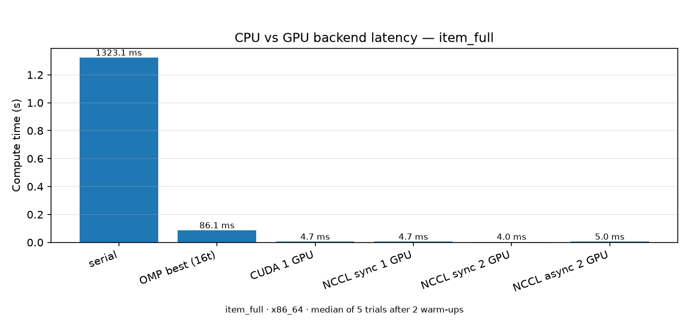
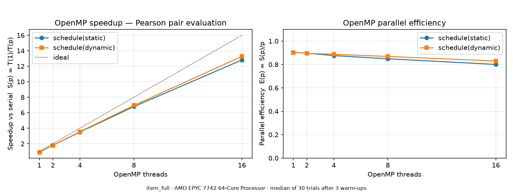
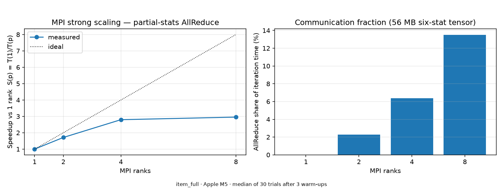
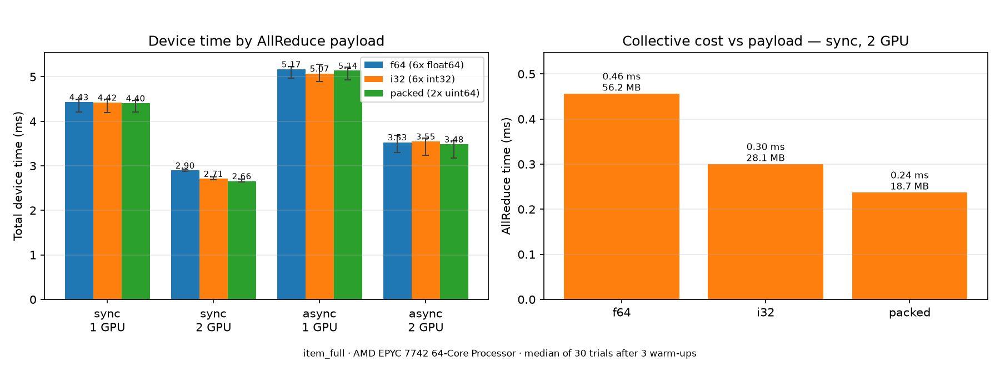
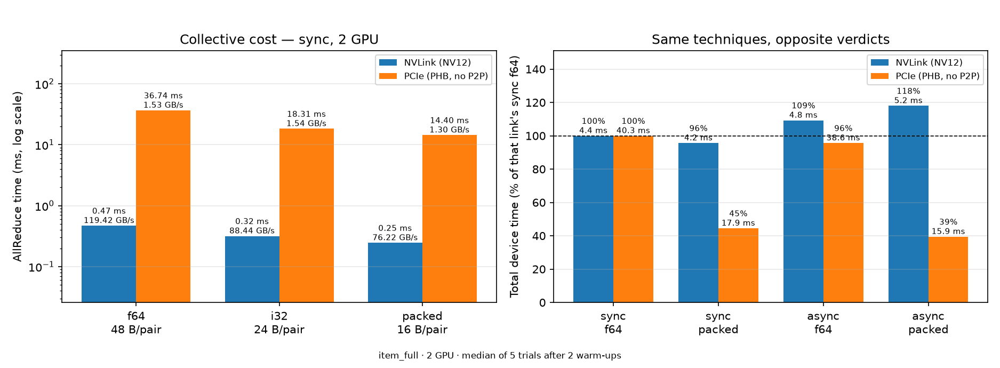

# Multi-Backend Pearson Similarity Engine

An archived Yelp recommender — originally USC INF553-Data-Mining-2020 project: PySpark, MinHash/LSH, item- and user-based collaborative filtering — rebuilt as a systems study.

Collaborative filtering scores a candidate pair of items by how alike their co-raters rated them, and that score is a Pearson correlation. This project extracts that one kernel behind a frozen numerical contract, exports it as backend-neutral binary workloads, and re-implements it across serial C++, OpenMP, MPI, single-GPU CUDA, and two-GPU NCCL (synchronous and async/overlapped) — every backend validated against the same golden similarities. Prediction and RMSE evaluation stay in Python; the native backends stop at similarities.

Hope this project can start my research journey of MLSys, AI infra, and parallel computing.

## Start here

This is a study of one question: **when is it worth compressing what a
collective sends?**

The workload is a recommender kernel, but its shape will be familiar from
data-parallel training. Each GPU computes a partial result over its shard of
the data, then an **AllReduce** sums the partials. In DDP those partials are
gradients; here they are six statistics per item pair — 1,171,857 pairs x 6
float64 = **56 MB moved every iteration**.

The finding: those six numbers are secretly small integers, because the
ratings behind them are 1-5 stars. So the 56 MB packs into **18.7 MB with no
loss at all** — and the packed words can be summed *while still packed*, so
NCCL never sees the uncompressed form.

Whether that 3x is worth anything depends entirely on the link:

| | NVLink | PCIe |
| --- | --- | --- |
| Communication is... | 11% of the iteration | 91% of the iteration |
| ...so compressing 3x buys | **4%** | **55%** |

Same binary, same data, same GPU model — but **two different hosts**, so read
this as two communication regimes rather than one variable swapped. Toggling
P2P on a *single* machine reproduces the same trend with everything else held
fixed (see the measurement audit below). The point survives the narrowing: **compressing a
collective pays when the collective is the bottleneck, and not otherwise** —
and the second half of that sentence is the part usually left out.

Three terms used throughout, if the vocabulary is unfamiliar:

- **six-stat tensor** — the AllReduce payload: `(n, Sx, Sy, Sxx, Syy, Sxy)`
  per pair. Enough to finish the correlation after summing, the way gradient
  buffers are enough to finish an optimizer step.
- **sync vs async** — sync does one big AllReduce after all the compute.
  Async splits the pairs into chunks and overlaps chunk *c*'s AllReduce with
  chunk *c+1*'s compute, the way DDP overlaps gradient buckets with backward.
- **f64 / i32 / packed** — the three payload encodings, 48 / 24 / 16 bytes
  per pair. All three produce bit-identical results.


## Layout

| Path | Contents |
| --- | --- |
| `original_code/` | Frozen original homework code + data (SHA-256 manifest, read-only) |
| `spark_pipeline/` | Maintained PySpark baseline: `cf_train.py`, `cf_predict.py`, fixture exporter, pinned env |
| `docs/pearson_contract.md` | The frozen numerical contract every backend implements |
| `docs/analysis.md` | Mechanism: roofline of the overlap, Nsight evidence, per-link regimes |
| `tools/` | Spark-free validator, reference impl, archived-model cross-check, RMSE loop, fixture generators, bit-width audit |
| `data/fixtures/` | 6 exported workloads (CSR ratings + candidate pairs + golden sims), 5 synthetic domain-gate fixtures; overlap bands are generated, not tracked |
| `engine/` | Native engine: CMake, serial/OpenMP/MPI/CUDA/NCCL backends, tests, bench |
| `results/` | Benchmark JSON/CSV, figures, prediction outputs |

## The contract (docs/pearson_contract.md)

All backends compute, for the same candidate pairs, the six sufficient
statistics (n, Σx, Σy, Σx², Σy², Σxy) over the intersection of two rating
rows, with pair-local means, minimum overlap 3, zero-variance ⇒ sim 0, an
output filter `sim > 1e-14`, and absolute tolerance ≤ 1e-12 against the
serial reference. Distributed backends (MPI, NCCL) partition the RATING
DIMENSION and AllReduce partial six-stat tensors — pairs are never sharded.

## Results

Workload: `item_full` — 1,171,857 candidate pairs, 488,560 ratings. Every
benchmark trial ran with `--validate`; **every backend matches the golden
similarities bit-exactly (max |diff| = 0.0)**. CPU study on Apple M5; GPU
study on RunPod pods with 2x A100-SXM4-80GB (NV12 NVLink) and, for the
interconnect A/B, 2x A100 80GB PCIe (PHB, no P2P) — CUDA 12.8, NCCL 2.25.1
throughout (environments recorded in `results/gpu_env*.txt`).

### Backend comparison

**One machine, one timing basis.** EPYC 7742 + 2x A100-SXM4-80GB (NV12),
30 trials after 3 warm-ups, round-robin with a per-round reshuffle
(seed 20260905). Times are **steady-state**: `device_total = stats +
allreduce + finalize` for everything except async, which reports
`pipeline_total` because its stages overlap. Fixture load, device setup and
H2D/D2H are excluded; `cold_data_path_s` in every result file carries the
cold-start view (see the audit document below).

| Backend | Median | Speedup vs same-machine serial |
| --- | --- | --- |
| Serial C++ (oracle) | 1318.88 ms | 1.00x |
| OpenMP 16t dynamic | 86.665 ms | 15.22x |
| MPI 16 ranks | 275.699 ms | 4.78x |
| CUDA warp-per-pair, 1 GPU | 4.753 ms | 277.48x |
| **NCCL sync `packed`, 2 GPU** | **3.977 ms** | **331.63x** |
| NCCL async `packed`, 2 GPU | 4.409 ms | 299.17x |

Every earlier version of this table mixed hardware — MPI from a laptop, GPU
rows from pods — so its speedups were computed against two different serial
baselines. This one is not.

Later commits changed documentation, the MPI load field and the replication
tooling, none of which touch the steady-state kernels, so these numbers stand
for the current tree — but they were not re-measured on it.



Log scale, because the span is 1318.9 ms to 4.0 ms. Whiskers are the
interquartile range over 30 trials: note that `NCCL async 2 GPU` has a
visibly wider one than every other bar. That 13-16% spread survives
randomisation and reproduces across pods -- see the measurement audit -- so
the picture is the finding, not an artefact of one session.

Key takeaways:

- **277-332x over one CPU core** on the same machine, ~15-20x over the best
  16-thread OpenMP configuration on that machine.
- **A second GPU adds only 1.14-1.20x.** Only the rating dimension is split;
  every GPU still touches every pair, so the per-pair work does not halve.
- **On NVLink, neither optimisation is worth it.** Compressing the collective
  3x buys 4.3%; async overlap *costs* 9.3%. Communication is 11% of the
  iteration, so there is very little there to win.
- **On PCIe, compression reverses** and buys 55%. Async also turned positive
  there, but see the measurement audit below: every async 2-GPU row in this study
  carries a 12–44% IQR, so async differences of this size are at the edge of
  what these hosts resolve. The compression rows reproduce to under 0.3%.
- **End-to-end RMSE 0.8652** (archived Spark model 0.8657; target 0.9).

<details>
<summary>Provenance of these numbers</summary>

`results/bench/bench_20260905_064736.json`, measured at commit `12e9917`. That
run predates the provenance fields, so its `environment` block carries no
`git_sha`; no result file in this repository records an `image_digest`.
Reproducing it exactly means checking out `12e9917` and rerunning
`engine/bench/run_bench.py --repeats 30 --warmups 3 --gpu --seed 20260905` on
an EPYC 7742 with 2x A100-SXM4-80GB (NV12).

</details>

OpenMP scaling (M5, 30 trials; the 4→8t knee is the P-core/E-core boundary —
and the measurement audit below shows that knee, not workload skew, is most of what
dynamic scheduling buys):



MPI scaling (EPYC 7742 pod, 30 trials, ranks to 48; peak 5.04x at 16, and the
AllReduce share climbs to 51% by 48 ranks — the CPU-time quota and the growing
collective are confounded there, see the measurement audit below. On the smaller
fixtures the collective dominates far earlier: at 9,054 pairs it is 83% and MPI
turns net slower than serial):



Collective payload compression (A100 NVLink pod, 30 trials; right panel is the
one that matters — the collective shrinks 1.9x, but it was only ~11% of the
iteration. In the left panel the `async 2 GPU` group is the only one whose
IQR whiskers are wide enough to see):



Raw benchmark logs live in `results/bench/` (regenerate figures with
`engine/bench/make_figures.py <bench.json>`). The Nsight traces behind
[docs/analysis.md](docs/analysis.md) are not shipped: `nsys` records the
profiled process's environment into the trace, and these were captured on
hosts with credentials in the environment. Everything derived from them is
written up there.

## Lossless compression of the collective payload

The AllReduce carries `(n, Sx, Sy, Sxx, Syy, Sxy)` as six float64 per pair --
56.25 MB for `item_full`. But the fixture's ratings are Yelp stars, taking
exactly five values `{1,2,3,4,5}`, so **all six statistics are exact
non-negative integers**, bounded by the longest rating row `N = 1363`:
`n <= N`, `Sx,Sy <= 5N`, `Sxx,Syy,Sxy <= 25N = 34,075`. Sixteen bits of
content in 384 bits of wire format.

`--payload` selects the representation (`docs/pearson_contract.md` §9):

| `--payload` | Layout | Bytes/pair | AllReduce | Ratio |
| --- | --- | --- | --- | --- |
| `f64` (default) | 6 x float64 | 48 | 56.25 MB | 1.00x |
| `i32` | 6 x int32 | 24 | 28.12 MB | 2.00x |
| `packed` | 2 x uint64 | 16 | 18.75 MB | 3.00x |

`packed` gives each field 21 bits with no shared carry space
(`word0 = n | Sx<<21 | Sy<<42`). Because the partition is over the rating
dimension, a field's cross-GPU sum *is* the global total, which the domain
gate bounds below 2^21 -- so no field can carry into its neighbour and
`pack(a) + pack(b) == pack(a + b)`. The packed words therefore go **straight
to `ncclSum` over `ncclUint64`**: the collective never sees the uncompressed
form, and unpacking happens once, in the finalize kernel.

This is lossless by construction rather than lossy within a tolerance, which
is what lets the frozen bit-exact contract survive compression untouched.
`check_payload_domain()` refuses `i32`/`packed` up front on any fixture
outside the domain -- a silently overflowed field would corrupt the sum while
every backend still agreed with itself.

Correctness first: all 18 device gates pass bit-exact — 3 payloads x
{sync, async} x {1, 2} GPUs on `item_full`, plus 3 payloads x 2 modes on
`user_full`, every one at `max_abs_diff = 0.0` with identical emitted counts
(557,478 / 634,993). The CPU-side `cuda_emulation_test` agrees over the same
2.58 M pairs at 1-, 2-, and 3-way rank splits.

On NVLink the 3x payload cut made the collective **1.9x faster**
(0.471 -> 0.246 ms) but the iteration only **4.3%** faster, because the
collective was just 10.7% of it to begin with. The single-GPU rows are the
control: with no peer to reduce against, totals sit within 0.6% of each other
at every payload, so the packing itself costs nothing measurable and the whole
effect lives in the collective, exactly where the design put it.
[Full breakdown](docs/analysis.md#where-the-nvlink-gain-went).

Read together with the async result this is one coherent negative finding
rather than two disappointments: **on a fast interconnect this workload is not
communication-bound, so neither hiding communication nor shrinking it moves
the needle.** Both techniques target the same regime, and NVLink is not it.

### The same techniques on a slow interconnect

To test the converse, the identical binary was run on 2x A100 80GB **PCIe**
(`PHB` topology, P2P reported `NS` — so NCCL stages through host memory
rather than moving GPU-to-GPU). Same GPU generation, same memory class, same
CUDA 12.8 and NCCL 2.25.1, same SHA-verified sources: the interconnect is
close to the only variable. All 18 correctness gates pass bit-exact here too,
which is what the contract promised — the partition is over the rating
dimension, so the answer cannot depend on the link.



| | NVLink (NV12) | PCIe (PHB, no P2P) |
| --- | --- | --- |
| AllReduce, `f64` sync 2 GPU | 0.47 ms | 36.74 ms (78x) |
| Communication share of iteration | 10.7% | 91.1% |
| Compression, `f64` → `packed` | **-4.3%** | **-55.5%** |
| Async overlap, sync → async at `f64` | **+9.3%** (worse) | **-4.3%** (better) |
| Both together | +18.0% (worse) | **-60.5%** (40.3 → 15.9 ms) |
| Best configuration | `sync packed`, 4.21 ms | `async packed`, 15.92 ms |

**Every verdict reverses.** Compression goes from a 4.3% curiosity to a 55%
win, async overlap changes sign, and the best configuration moves from sync
to async. Nothing about the code changed; only the ratio of communication to
computation did.

The deciding factor is not the interconnect's name but whether the
collective is **bandwidth-bound**. Under payload reduction, effective
bandwidth stays flat on PCIe (~1.5 GB/s, the link is genuinely saturated) and
*falls* on NVLink (119 -> 76 GB/s, the collective is latency- and launch-bound
and smaller messages cannot fill it). Only a saturated link converts saved
bytes into saved time roughly one-for-one.
[Full analysis](docs/analysis.md#which-regime-the-collective-is-in).

## Findings / limitations

- The async chunk-size sweep caught a real double-buffering race in the async
  pipeline (slot-free event recorded before the finalize kernel that reads
  the slot); fixed by reordering, after which every chunk size validates
  bit-exact. See the comment in `engine/src/nccl/nccl_main.cu`.
- Async overlap loses its A/B on NVLink even though the pipeline works,
  because overlap's ceiling is `min(compute, comm)/total` — it pays when the
  two are comparable, not when communication is large. That corrects this
  project's original "async targets slow interconnects" hypothesis. The cost
  is paid differently on each link and both were measured; see
  [the mechanism](docs/analysis.md#why-overlap-is-capped-on-both-links).
- Lossless 3x payload compression hits the same ceiling from the other side:
  the collective really does get 1.9x faster, but it was 10.7% of the
  iteration, so end-to-end gain is 4.3%.
- Running the identical binary on 2x A100 PCIe reverses both verdicts
  (compression -55.5%, async overlap positive, best config moves from sync to
  async). The deciding factor is not the interconnect's name but whether the
  collective is bandwidth-bound: effective bandwidth stays flat under payload
  reduction on PCIe (~1.5 GB/s) and falls on NVLink (119 → 76 GB/s), so only
  the former converts saved bytes into saved time. Both optimisations are
  therefore worth their complexity on commodity multi-GPU hosts and not on
  NVLink ones — a conclusion neither measurement could have reached alone.
- `--payload i32`/`packed` are only valid inside their integer domain, and
  `check_payload_domain()` enforces it. Neither branch fires on the shipped
  fixtures (all {1,2,3,4,5}-rated, worst statistic 34,075 against a 2^21-1
  field), so the gate is **not exercised** — coverable with a synthetic
  fixture, not untestable.
- The original homework's `user_based` predict branch writes `user_id` and
  `business_id` swapped in its output JSON (inherited defect, kept for
  faithfulness); swap keys when evaluating (native user model: RMSE 0.9461).
- The dataset is the course-provided California subset of Yelp; candidate
  generation (item-item Cartesian over qualified pairs, user-user LSH)
  follows the original assignment and is part of the frozen contract.

## Reproduction

### 0. Environment (macOS arm64 used for CPU phases)

```bash
brew install openjdk@17 cmake libomp open-mpi
uv venv .venv && uv pip install -r spark_pipeline/requirements.txt matplotlib
export JAVA_HOME=/opt/homebrew/opt/openjdk@17/libexec/openjdk.jdk/Contents/Home
export PYSPARK_PYTHON=$PWD/.venv/bin/python PYSPARK_DRIVER_PYTHON=$PWD/.venv/bin/python
```

### 1. Spark baseline and fixtures

The exported fixtures are committed, so **a fresh clone can skip straight to
step 2**. This step re-derives them and needs the raw Yelp corpus
(`original_code/python/data`, 492 MB), which is too large to ship.

```bash
DATA=original_code/python/data
# Reproduce the archived golden model (item-based CF):
.venv/bin/python spark_pipeline/cf_train.py $DATA/train_review.json /tmp/model item_based
# Export + validate a backend-neutral fixture:
.venv/bin/python spark_pipeline/export_fixture.py $DATA/train_review.json data/fixtures/item_full item
python3 tools/validate_fixture.py data/fixtures/item_full
```

### 2. Native engine (CPU)

```bash
cmake -S engine -B engine/build -DCMAKE_BUILD_TYPE=Release \
      -DENGINE_OPENMP=ON -DENGINE_MPI=ON \
      -DOpenMP_ROOT=/opt/homebrew/opt/libomp   # macOS only: Apple clang needs the hint
cmake --build engine/build -j
ctest --test-dir engine/build --output-on-failure   # microcases + CUDA emulation
engine/build/pearson_engine data/fixtures/item_full --backend serial --validate
OMP_NUM_THREADS=8 engine/build/pearson_engine data/fixtures/item_full --backend openmp --validate
mpirun -np 4 engine/build/pearson_engine_mpi data/fixtures/item_full --validate
```

### 3. Benchmarks and figures

```bash
python3 engine/bench/run_bench.py                    # add --gpu on a GPU host
.venv/bin/python engine/bench/make_figures.py results/bench/bench_<stamp>.json
```

### 4. End-to-end RMSE (native similarities → Python prediction)

```bash
engine/build/pearson_engine data/fixtures/item_full --backend serial --out /tmp/sims.bin
python3 tools/sims_to_model.py data/fixtures/item_full /tmp/sims.bin /tmp/native.model
.venv/bin/python spark_pipeline/cf_predict.py $DATA/train_review.json \
    $DATA/test_review.json /tmp/native.model /tmp/pred.json item_based
python3 tools/rmse.py /tmp/pred.json $DATA/test_review_ratings.json \
    $DATA/business_avg.json item
```

### 5. GPU phases

On a dual-GPU Linux host, build with `-DENGINE_CUDA=ON -DENGINE_NCCL=ON` and
clear the correctness ladder before timing anything:

```bash
# single-GPU CUDA vs golden, smallest fixture first
for f in item_tiny item_medium item_full user_full; do
  engine/build/pearson_engine data/fixtures/$f --backend cuda --validate
done
# NCCL: one GPU, then two, then the async pipeline across chunk sizes
engine/build/pearson_engine_nccl data/fixtures/item_full --gpus 1 --mode sync --validate
engine/build/pearson_engine_nccl data/fixtures/item_full --gpus 2 --mode sync --validate
for c in 32768 65536 131072 262144 524288; do
  engine/build/pearson_engine_nccl data/fixtures/item_full \
      --gpus 2 --mode async --chunk $c --validate
done
```

Every run must report `max_abs_diff = 0` and `tol_failures = 0`. The async
chunk sweep is not optional: the double-buffering race below only surfaced
below 262144 pairs per chunk. Benchmarks come after.

## Update: Measurement audit and headline rebuild -- 20260905

A one-day audit found that several published numbers did not mean what they
said. Full record, with the arithmetic and the wrong turns:
**[docs/measurement_audit_20260905.md](docs/measurement_audit_20260905.md)**.

What changed, in one table:

| | Was | Is |
| --- | --- | --- |
| headline table | laptop MPI + pod GPU rows, two serial baselines | one machine, one timing basis (above) |
| timing definition | NCCL sync excluded its finalize kernel | `device_total = stats + allreduce + finalize` everywhere |
| run order | 30 consecutive trials per config | round-robin, reshuffled each round, seed recorded |
| payload content | "sixteen bits" | 85 bits — that was the widest field, not the total |
| async on PCIe | a property of the link | finalize occupying the communication stream |
| interconnect claim | "only the interconnect changed" | two hosts, two regimes — plus a within-host P2P A/B |

Measurements added: a third interconnect regime on a real `PHB`/no-P2P host,
the problem-size and overlap sweeps the project brief specified and never ran,
a calibrated `nccl-tests` baseline at exact payload sizes, and the compression
effect replicated across three independent sessions at **−4.81% / −4.99% /
−5.08%** (0.27 percentage points apart).


## Update: implement warp packing -- 20260905

The optimisation the September audit left unimplemented. It works — and not for
the reason the audit predicted. Full record, with the correctness ladder, the
paired intervals and the mechanism analysis:
**[docs/warp_packing_experiment_20260905.md](docs/warp_packing_experiment_20260905.md)**.

A pair now gets a sub-warp of `G` lanes instead of all 32, with pairs sorted by
shorter-slice length so the groups sharing a warp need the same round count
(`--group`, `--pair-order`, on both GPU binaries).

| | vs the pre-packing binary | 95% CI |
| --- | --- | --- |
| CUDA 1 GPU, `item_full` | **−34.68%** | [−34.98, −34.37] |
| NCCL 2 GPU sync `packed` | **−47.62%** | [−47.99, −47.24] |

30 balanced crossover blocks each, seeds recorded. 172 correctness checks pass
bit-exact first — every payload, 1/2/3 ranks, every group size and ordering —
with output byte-identical to the baseline's and no memory errors under
`compute-sanitizer`.

**The lane-slot model was quantitatively wrong.** It predicted 19.2% at two
GPUs from recovering the partly-filled last warp round. Critical lane slots did
fall 18.3%, but stats time fell 51.2%. Most of the gain is a cost the model
never counted: `pair_lane_stats` runs four `lower_bound` searches *per thread*
to locate each row's slice, and every lane of a group repeats them, so that
cost scales with `G`. The `lane_full` fixture settles it — its lane slots vary
by 0.02% across group sizes and its time still drops 13.5%. `G=1`, which the
model says is optimal at 99.96% lane utilisation, is the *worst* arm measured.

**The default is unchanged.** `--group 4 --pair-order bylen` is the
recommendation, but switching it obliges re-running the headline matrix and the
compression A/B on a frozen SHA, and this session stopped at its spending cap
first. The table above and the headline table earlier both describe the
mapping the binaries actually default to today.
