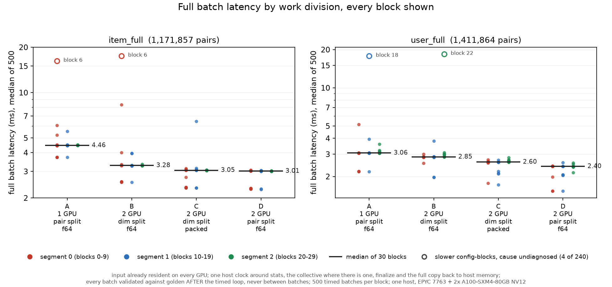
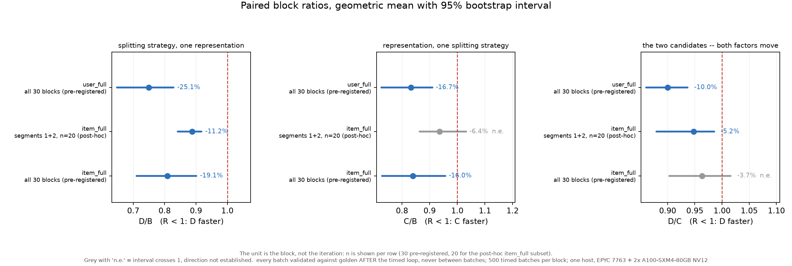

# Which axis should the work be divided on?

**2026-09-17 · one host · `8c8833e` · binary `6c5040db`**

## The question

Both GPUs already hold the entire input — the CSR ratings, the candidate
pairs, the order. Given that, the engine's original decomposition is not the
only one available:

* **split the rating dimension** — every device computes every pair over its
  own slice of the dimensions, and an AllReduce sums six partial statistics
  per pair. This is what the engine has always done, and what the compressed
  payload work is about.
* **split the pairs** — every device computes a disjoint run of pairs to
  completion over the full dimension range. No collective at all.

The repository had never asked which is faster. It answers a question the
compression study presupposes: the compression only matters if the collective
should be there in the first place.

## The four configurations

| | GPUs | split | payload | collective |
| --- | --- | --- | --- | --- |
| **A** | 1 | pairs | f64 | none |
| **B** | 2 | dimension | f64 | 1 × 48 B/pair |
| **C** | 2 | dimension | packed | 1 × 16 B/pair |
| **D** | 2 | pairs | f64 | none |

Everything else is held fixed: one binary, sync mode, `--group 4`,
`--pair-order source`, hoist off, plan metrics off, every batch validated.

`D/B` isolates the splitting strategy at one representation and is the primary
comparison. `C/B` isolates the representation at one splitting strategy.
`D/C` compares the two real candidates but moves both factors, so it cannot
attribute the difference to either alone.

## What was measured

`resident_host_complete_ms`: one host clock around statistics, the collective
where there is one, finalize, and the **full copy back to host memory**, with
the input already resident and the buffers already allocated. It excludes
process launch, fixture load, allocation, the first H2D and communicator
setup. It is a batch latency for a warm, resident engine — not a cold start,
not a per-user online request, and not a service throughput.

500 timed batches per block; a block is one run of all four configurations in
a seeded random order; 30 blocks per workload in three segments separated by
180 s. **The unit of analysis is the block, not the iteration** — 30 paired
observations, not 15,000.

The estimator is the paired geometric mean `R = exp(mean(log(t_x/t_y)))` over
blocks, with a 95 % percentile interval from a 5,000-draw block bootstrap
stratified by segment. This is not the ratio of the two medians and is not
reported as one.

## Results



| | item_full (1,171,857 pairs) | | user_full (1,411,864 pairs) | |
| --- | --- | --- | --- | --- |
| | median ms | IQR | median ms | IQR |
| A 1 GPU, pairs, f64 | 4.461 | 0.030 | 3.064 | 0.041 |
| B 2 GPU, dim, f64 | 3.284 | 0.036 | 2.852 | 0.058 |
| C 2 GPU, dim, packed | 3.054 | 0.424 | 2.599 | 0.050 |
| **D 2 GPU, pairs, f64** | **3.012** | 0.190 | **2.401** | 0.281 |



| | D/B | C/B | D/C |
| --- | --- | --- | --- |
| item_full, all 30 blocks — *pre-registered* | **0.809** [0.711, 0.901] | 0.840 [0.728, 0.957] | 0.963 [0.903, 1.016] *n.e.* |
| user_full, all 30 blocks — *pre-registered* | **0.749** [0.648, 0.828] | 0.833 [0.726, 0.910] | 0.900 [0.861, 0.937] |
| item_full, segments 1+2 only — *post-hoc, n=20* | 0.888 [0.841, 0.918] | 0.936 [0.864, 1.032] *n.e.* | 0.948 [0.879, 0.986] |

*n.e.* = interval crosses 1, direction not established.

**Splitting pairs gives lower full-batch latency than splitting the rating
dimension**, by 19.1 % on item_full and 25.1 % on user_full relative to B in
the pre-registered analysis (11.2 % in the post-hoc item_full subset). Faster
on every analysis of both workloads. Since both devices already hold
the whole input, the AllReduce the engine was built around buys nothing that
the pair split does not get for free.

**Compression pays in the pre-registered analysis, but sensitively.** `C/B` is established
in the pre-registered analysis of **both** workloads (`C/B` 0.840 and 0.833,
both intervals below 1). It stops being established in a post-hoc subset of
item_full that drops segment 0, leaving 20 blocks. The pre-registered result
is the result; the subset says the item_full gain is sensitive to which time
segments are used. Neither is quoted in place of the other.

This cannot be compared to the README's compression figures. Those are on
`device_total`; this is on `resident_host_complete`, which additionally
includes the copy back to host — and the two runs also differ in machine,
commit and execution model. An earlier draft of this document explained the
difference by the copy back alone, and predicted a *smaller* gain here. That
was wrong in both direction and reasoning: the NVLink gain on `device_total`
was ~5–7 %, and the gain measured here is ~16 %. No single-cause explanation
is offered. The two bases are not comparable, and that is the whole claim.

## Two measurement problems

**Validation between batches cost 1.8×** — found in the pilot, fixed before
any formal data was collected. Validating each iteration inside the
timed loop left both GPUs idle ~5 ms per batch; the driver dropped the SM
clock from 1410 MHz to ~795 MHz and every later batch ran 1.77× slower, as a
clean step mid-run. `1410/795 = 1.77` matched the step for one GPU and for
two. Each iteration now writes to its own output slot and all slots are
checked after the timed loop: identical coverage, no host work between
batches. Clock locking is refused inside the container.

**item_full's segment 0 differs from its other two** — found in the formal
data, not before it. Segment 0 is part of the pre-registered sample and is
kept in the main analysis. What is measured: C and D drift +19.9 % and
+12.9 % from segment 0 to segment 2, while A and B move +0.1 % and +0.2 %.
user_full, run immediately afterwards from 30 minutes of sustained load, is
flat to within 2.5 % in every configuration.

A settling explanation — the GPUs not yet at a steady clock during the first
ten blocks — is consistent with both observations and predicted the second
before it was seen. It is **not confirmed**: no clock or power trace was
recorded alongside these blocks, so other time-correlated causes are not
excluded, and a later workload being stable does not establish the cause of
an earlier one. Treat it as an open question with a leading hypothesis, and
treat the segments 1+2 figures as a post-hoc sensitivity analysis rather than
as a steady-state measurement.

## Correctness

Every number above comes from a run that validated 500/500 batches against
golden. Across the whole matrix: **240 config-blocks, 120,000 timed batches,
0 failures.**

| gate | result |
| --- | --- |
| pair-count boundaries × 4 configs (N = 1,2,3,63,64,65,127,128,129,511,512,513) | 48/48 |
| both formal workloads × 4 configs | 8/8 |
| 20 resident batches reused in one process, each validated | 4/4 |
| combinations that must be refused (packed, bylen, async, warmup without resident) | 4/4 refused |
| compute-sanitizer, A and D (no NCCL init) | `ERROR SUMMARY: 0 errors` |
| compute-sanitizer, B and C (NCCL init) | **94 reports each**, every one `cudaErrorPeerAccessAlreadyEnabled` with a libnccl backtrace — reclassified, not absent |
| host test suite on the pod | 13/13 |

B and C are not "sanitizer clean with zero reports". They have 94 reports
each, reclassified on two independent grounds: NCCL 2.21.5 handles and clears
the duplicate-peer-access return code in `src/transport/p2p.cc`, and A and D
— which never initialise NCCL — report zero on the same binary and fixture.
Across all four logs the only error kind present is
`cudaErrorPeerAccessAlreadyEnabled`. Verdicts, the exact command and a
negative control (B without the allowance must fail, and does) are in
`results/bench/architecture_pilot_20260917/sanitizer_recheck.txt`; the
superseded `sanitizer_verdict.txt` is kept beside it with a note explaining
why it says otherwise.

Per-config detail in the formal records is the **last** output slot's
`max_abs_diff`; the other 499 are recorded as pass/fail booleans. "All
120,000 batches passed the tolerance check" is supported by these records;
"all 120,000 recorded a zero error" is not.

Fault injection (`engine/tests/`): the output checker rejects NaN, ±Inf into
either side, short arrays, a swap that preserves the emitted count, and a
retained-set change within tolerance — 60 checks, plus 31 end-to-end against
the real binary's exit code and JSON. The pair-partition write path is
replayed on the host with three wrong implementations, each required to be
caught.

## Limitations

* **One host, one GPU generation, one interconnect.** EPYC 7763 + 2 × A100-SXM4-80GB
  NV12. Three time segments on one machine are not three machines. Nothing
  here generalises to PCIe, to more than two GPUs, or to other chips.
* **A is the weakest row.** Its batch time is bimodal between two clock states
  and its median did not reproduce across processes in pre-flight
  (4.44 / 6.05 / 5.89 ms). `D/A` and `C/A` inherit that; `D/B` and `C/B` do
  not, since those configurations were stable.
* **Four of 240 config-blocks ran 5–6× slow** (medians 16–18 ms against a
  ~3 ms typical, max 41 ms), all in A or B. The cause was not diagnosed —
  nothing external was being recorded at the time, so "host interference" is
  a guess, not a finding. They are **kept** in the headline analysis.
  Excluding blocks with any configuration above 10 ms changes no conclusion
  and makes every effect *smaller*: item_full D/B 0.809 → 0.853, user_full
  D/B 0.749 → 0.794. That threshold and that exclusion were both chosen after
  seeing the data and are reported as such.
* **`max_abs_diff = 0` is numeric equality, not a bitwise comparison.** No
  bit-exactness claim is made from it here.
* **The collective sizes are representation sizes**, not measured link
  traffic: 48 B/pair for B and 16 B/pair for C, giving 56,249,136 and
  18,749,712 bytes per rank on item_full. No network counter was read.
* Not tested: async mode, `bylen` ordering, i32, more than two GPUs, or any
  pair split other than a contiguous even division.

## Checks the protocol asked for that were NOT run

Listed because an unrun check is not a passed one, and none of these is a
reason to doubt the results above.

* **Timing-boundary perturbation.** `--resident-delay-in-band-ms` and
  `--resident-delay-out-of-band-ms` exist and type-check in both build
  variants, but no profiling build was run, so there is no *measured* record
  that a known delay inside the timed region raises the metric and one
  outside it does not. `results/bench/architecture_pilot_20260917/timing_boundary.txt`
  says only that it needs a separate run. The boundary is verifiable by
  reading the source; it has not been verified by perturbation.
* **Per-iteration six-statistic read-back / poison test on the GPU path.**
  What was validated every iteration is the final similarity. The six
  statistics were not read back and compared per iteration, so the specific
  failure mode of a reduced buffer being summed again on the next iteration
  is argued from the source (the stats kernels overwrite rather than
  accumulate) rather than demonstrated.

  The reuse runs are **weaker evidence than they look**. Pearson is invariant
  under a uniform positive scaling of all six statistics: multiply
  `(n, Σx, Σy, Σxx, Σyy, Σxy)` by `k` and both numerator and denominator scale
  by `k²`, so the similarity is **mathematically unchanged**. In floating point
  the output may come back identical, or land within the 1e-12 tolerance, since
  the intermediate roundings are not the same — no claim is made that it always
  does, and near-zero variance is exactly where it might not. That is enough:
  an error of this shape can pass a tolerance check, so passing one does not
  exclude it. A stale buffer summed
  again on the next iteration is exactly that kind of uniform scaling. So the
  20- and 500-batch reuse runs establish that the final similarities are
  correct every iteration; they cannot exclude a proportional inflation of the
  statistics behind them. Only a per-iteration read-back of the six statistics
  would, and it was not run.
* **Provenance inside the JSON.** `git_sha`, `git_dirty` and `image_digest`
  are null in these formal records, because the pod received a `git archive`
  and had no `.git`. The version link comes from `host_manifest.txt` and
  `binary_hash.txt` beside them, not from the record itself. The pilot and
  formal binaries are different builds and are hashed separately.
* **Harness input hardening.** `architecture_ab.py` validates each record's
  schema and shape but does not yet bind a record to the configuration it was
  asked for, independently recompute the median it trusts, or refuse to call
  an incomplete matrix formal. These records were checked separately and are
  correct on all three counts; the gaps should close before the next run.

## Reproduction

```bash
python3 engine/bench/architecture_ab.py run \
    --binary engine/build/pearson_engine_nccl \
    --fixture data/fixtures/item_full \
    --out results/bench/architecture_formal_20260917/formal_item_full.json \
    --warmup 50 --repeat 500 --segment-pause 180 --seed 20260917
python3 engine/bench/architecture_ab.py analyze <that file>
.venv/bin/python engine/bench/make_architecture_figures.py
```

Raw records, environment, topology and binary hashes are in
`results/bench/architecture_formal_20260917/`; the pre-flight ladder is in
`results/bench/architecture_pilot_20260917/`.
